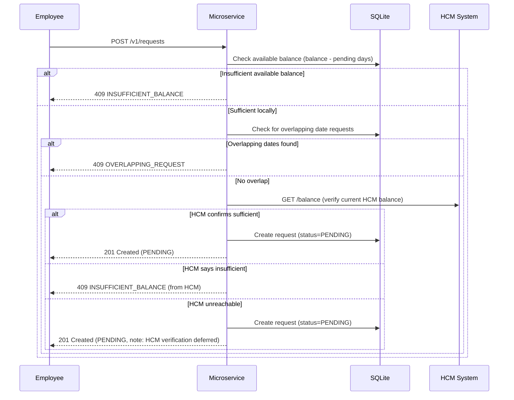
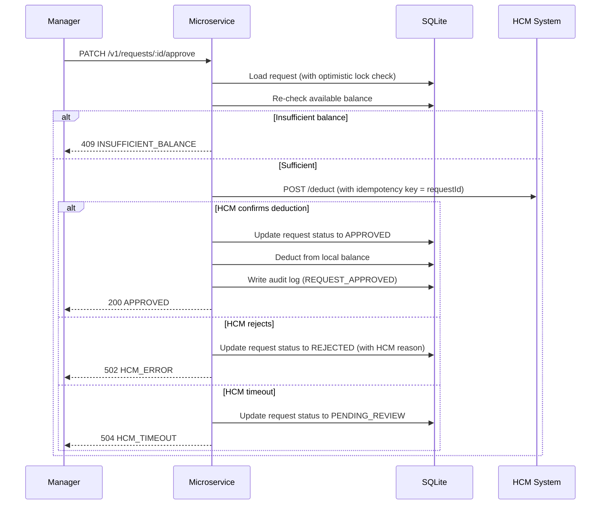
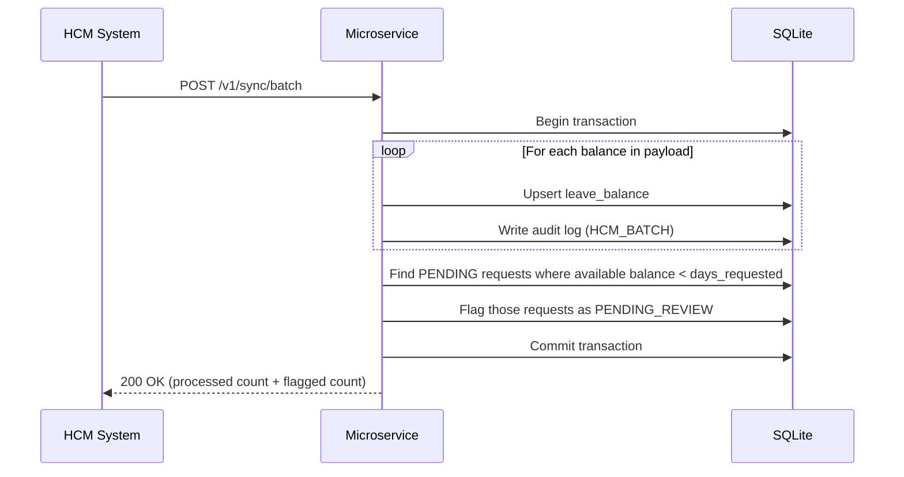

# Technical Requirements Document (TRD)
## Time-Off Microservice — ReadyOn

**Version:** 2.0  
**Date:** April 25, 2026  
**Status:** Final Draft

---

## Table of Contents

1. Overview
2. Technology Stack
3. Goals and Non-Goals
4. System Context
5. Data Model
6. API Endpoints
7. Core Workflows
8. Sync Strategy
9. Error Handling and Defensive Design
10. Concurrency and Race Conditions
11. Failure Scenarios
12. Alternatives Considered
13. Open Questions

---

## 1. Overview

This document describes the design of the **Time-Off Microservice** for ReadyOn. The service is responsible for:

- Accepting and managing employee time-off requests across multiple leave types (PTO, sick leave, etc.)
- Maintaining a local cache of leave balances
- Syncing those balances with an external Human Capital Management (HCM) system (e.g., Workday, SAP)
- Handling cases where the HCM updates balances independently of ReadyOn

The HCM is the **source of truth**. ReadyOn holds a **local copy** for performance and UX reasons, but always defers to HCM for final validation before approving a request.

---

## 2. Technology Stack

| Component | Technology | Rationale |
|---|---|---|
| Runtime | Node.js (LTS) | Assignment requirement |
| Framework | NestJS | Assignment requirement  provides modular architecture, DI, and built-in testing support |
| Database | SQLite (via TypeORM + better-sqlite3) | Assignment requirement — lightweight, zero-config, file-based |
| Validation | class-validator + class-transformer | NestJS-native DTO validation pipeline |
| API Docs | @nestjs/swagger | Auto-generated OpenAPI documentation |
| Testing | Jest (built-in with NestJS) | Unit, integration, and e2e testing with coverage reporting |
| Mock HCM | Express.js | Lightweight mock server to simulate HCM behaviors during testing |

---

## 3. Goals and Non-Goals

### Goals

- Provide REST endpoints for employees to submit time-off requests and view their balance
- Provide endpoints for managers to approve or reject requests
- Support multiple leave types (PTO, sick leave, personal, etc.) per employee per location
- Accept batch and real-time balance updates from HCM
- Be defensive: validate locally even when HCM error responses are not guaranteed
- Maintain audit trail of all balance changes
- Handle concurrent requests safely with optimistic locking

### Non-Goals

- Building the HCM system itself
- Authentication and authorization (assumed to be handled by a separate auth layer/gateway)
- Push notifications to employees
- Calendar integrations
- Leave accrual calculations (handled by HCM)

---

## 4. System Context

```
Employee / Manager (Client App)
            |
            v
  [Time-Off Microservice]  <--- this is what we are building
     |             |
     v             v
  SQLite DB     HCM System (Workday / SAP)
  (local cache) (source of truth)
```

### Two Sync Directions

**ReadyOn → HCM:** When a manager approves a request, we send a deduction to HCM and wait for confirmation.

**HCM → ReadyOn:** HCM pushes balance updates to ReadyOn either:
- In real-time (single employee / single location / single leave type update)
- Via batch (full dump of all balances)

### Key Constraints

- Balances are scoped to **employee + location + leave type**. A PTO balance for Employee A at Location X is separate from their sick leave balance at the same location.
- Partial-day requests are supported (e.g., 0.5 days).

---

## 5. Data Model

### Table: `leave_balance`

Stores the local cached copy of each employee's balance per location per leave type.

| Column | Type | Notes |
|---|---|---|
| id | UUID | Primary key |
| employee_id | string | From HCM |
| location_id | string | From HCM |
| leave_type | string | e.g., PTO, SICK, PERSONAL |
| balance_days | decimal | Current total balance from HCM |
| last_synced_at | timestamp | When this was last updated from HCM |
| created_at | timestamp | |
| updated_at | timestamp | |

**Unique constraint:** `(employee_id, location_id, leave_type)`

### Table: `time_off_request`

Stores every request an employee has made.

| Column | Type | Notes |
|---|---|---|
| id | UUID | Primary key |
| employee_id | string | |
| location_id | string | |
| leave_type | string | e.g., PTO, SICK, PERSONAL |
| start_date | date | |
| end_date | date | |
| days_requested | decimal | Computed from start/end, supports half-days |
| status | enum | PENDING, PENDING_REVIEW, APPROVED, REJECTED, CANCELLED |
| hcm_reference_id | string | ID returned from HCM on successful deduction |
| rejection_reason | string | Nullable |
| version | integer | Optimistic locking column |
| created_at | timestamp | |
| updated_at | timestamp | |

**Status definitions:**
- `PENDING` — Submitted by employee, awaiting manager approval
- `PENDING_REVIEW` — Was PENDING but a balance change (batch/realtime sync) may have invalidated it; manager must re-review
- `APPROVED` — Manager approved and HCM confirmed the deduction
- `REJECTED` — Manager rejected, or HCM rejected the deduction
- `CANCELLED` — Employee cancelled the request

### Table: `balance_audit_log`

Every change to a balance is recorded here for traceability.

| Column | Type | Notes |
|---|---|---|
| id | UUID | Primary key |
| employee_id | string | |
| location_id | string | |
| leave_type | string | |
| previous_balance | decimal | |
| new_balance | decimal | |
| change_source | enum | HCM_REALTIME, HCM_BATCH, REQUEST_APPROVED, REQUEST_CANCELLED |
| reference_id | string | e.g., the request ID or HCM transaction ID |
| created_at | timestamp | |

### Concept: Available Balance

The **available balance** is not stored directly. It is computed as:

```
available_balance = balance_days - SUM(days_requested) 
                    WHERE status IN ('PENDING', 'PENDING_REVIEW')
                    AND employee_id = X AND location_id = Y AND leave_type = Z
```

This ensures that pending requests "reserve" days and prevents over-booking even before manager approval.

---

## 6. API Endpoints

All endpoints return JSON. All error responses include a `code` and `message` field.

---

### 6.1 Employee Endpoints

#### `GET /v1/balances/:employeeId`

Returns all leave balances for an employee, grouped by location and leave type.

**Response (200):**
```json
{
  "employeeId": "emp_123",
  "balances": [
    { "locationId": "loc_nyc", "leaveType": "PTO", "totalDays": 10, "availableDays": 7, "pendingDays": 3, "lastSyncedAt": "2026-04-25T10:00:00Z", "stale": false },
    { "locationId": "loc_nyc", "leaveType": "SICK", "totalDays": 5, "availableDays": 5, "pendingDays": 0, "lastSyncedAt": "2026-04-25T10:00:00Z", "stale": false }
  ]
}
```

The `stale` flag indicates the cached balance may be outdated (see Section 8 — Staleness).

---

#### `GET /v1/balances/:employeeId/:locationId`

Returns balances for a specific employee at a specific location (all leave types).

**Response (200):** Same structure, filtered by location.

**Response (404):** `{ "code": "BALANCE_NOT_FOUND", "message": "No balance found for this employee at this location." }`

---

#### `POST /v1/requests`

Employee submits a time-off request.

**Request Body:**
```json
{
  "employeeId": "emp_123",
  "locationId": "loc_nyc",
  "leaveType": "PTO",
  "startDate": "2026-05-01",
  "endDate": "2026-05-03"
}
```

**Response (201 — success):**
```json
{
  "requestId": "req_abc",
  "status": "PENDING",
  "daysRequested": 3,
  "remainingBalance": 4
}
```

**Response (400 — validation error):**
```json
{ "code": "INVALID_DATES", "message": "End date must be after or equal to start date." }
```

**Response (409 — insufficient balance):**
```json
{
  "code": "INSUFFICIENT_BALANCE",
  "message": "Available balance is 2 days but 3 days were requested.",
  "availableBalance": 2
}
```

**Response (409 — overlapping dates):**
```json
{ "code": "OVERLAPPING_REQUEST", "message": "An existing request already covers some of these dates." }
```

---

#### `GET /v1/requests/:requestId`

Returns status and details of a specific request.

**Response (200):** Full request object.

**Response (404):** `{ "code": "REQUEST_NOT_FOUND", "message": "Request not found." }`

---

#### `DELETE /v1/requests/:requestId`

Employee cancels a request.

- If status is `PENDING` or `PENDING_REVIEW`: cancel immediately, no HCM call needed.
- If status is `APPROVED`: call HCM to restore the balance, then cancel locally. If HCM fails, flag for manual reconciliation.
- If status is `REJECTED` or `CANCELLED`: return 409 — cannot cancel.

**Response (200):** Updated request object with status `CANCELLED`.

**Response (409):** `{ "code": "INVALID_STATUS_TRANSITION", "message": "Cannot cancel a request with status REJECTED." }`

---

### 6.2 Manager Endpoints

#### `GET /v1/requests?status=PENDING&locationId=loc_nyc&page=1&limit=20`

Returns paginated requests visible to the manager, with filter support.

**Query Parameters:**
| Param | Type | Required | Description |
|---|---|---|---|
| status | string | No | Filter by status |
| locationId | string | No | Filter by location |
| employeeId | string | No | Filter by employee |
| leaveType | string | No | Filter by leave type |
| page | number | No | Default: 1 |
| limit | number | No | Default: 20, Max: 100 |

**Response (200):**
```json
{
  "data": [ ... ],
  "pagination": { "page": 1, "limit": 20, "total": 45, "totalPages": 3 }
}
```

---

#### `PATCH /v1/requests/:requestId/approve`

Manager approves a request. Triggers HCM deduction.

**Response (200):**
```json
{
  "requestId": "req_abc",
  "status": "APPROVED",
  "hcmReferenceId": "hcm_txn_789"
}
```

**Response (409 — balance changed):**
```json
{ "code": "INSUFFICIENT_BALANCE", "message": "Balance has changed since submission. Available: 1 day, requested: 3 days." }
```

**Response (502 — HCM error):**
```json
{ "code": "HCM_ERROR", "message": "HCM rejected the deduction: Invalid employee-location combination." }
```

**Response (504 — HCM timeout):**
```json
{ "code": "HCM_TIMEOUT", "message": "HCM did not respond in time. Request has been marked for review." }
```

---

#### `PATCH /v1/requests/:requestId/reject`

Manager rejects a request.

**Request Body:**
```json
{ "reason": "Team already short-staffed on those dates." }
```

**Response (200):** Updated request object with status `REJECTED`.

---

### 6.3 HCM Sync Endpoints

These endpoints are called **by the HCM system**, not by users.

#### `POST /v1/sync/batch`

HCM sends a full dump of all employee balances.

**Request Body:**
```json
{
  "balances": [
    { "employeeId": "emp_123", "locationId": "loc_nyc", "leaveType": "PTO", "balanceDays": 10 },
    { "employeeId": "emp_123", "locationId": "loc_nyc", "leaveType": "SICK", "balanceDays": 5 },
    { "employeeId": "emp_456", "locationId": "loc_nyc", "leaveType": "PTO", "balanceDays": 5.5 }
  ]
}
```

This is a **full overwrite** of the local cache for all employee+location+leaveType combinations present in the batch. Existing records not present in the batch are **retained** (the batch may be partial — e.g., only for one location).

**Response (200):**
```json
{ "processed": 3, "created": 1, "updated": 2, "flaggedRequests": 1 }
```

---

#### `POST /v1/sync/realtime`

HCM sends a single balance update (e.g., anniversary bonus, manual correction).

**Request Body:**
```json
{
  "employeeId": "emp_123",
  "locationId": "loc_nyc",
  "leaveType": "PTO",
  "balanceDays": 13,
  "reason": "WORK_ANNIVERSARY"
}
```

**Response (200):**
```json
{ "previousBalance": 10, "newBalance": 13, "changeSource": "HCM_REALTIME" }
```

---

#### `GET /v1/sync/status`

Returns the last time a batch sync was received and how many records were updated.

**Response (200):**
```json
{ "lastBatchSyncAt": "2026-04-25T06:00:00Z", "lastBatchRecordCount": 1250, "lastRealtimeSyncAt": "2026-04-25T09:45:00Z" }
```

---

## 7. Core Workflows

### 7.1 Submitting a Time-Off Request



> Note: We do not deduct balance on submission, only on approval. This avoids double-deduction if the request is rejected or cancelled.

---

### 7.2 Approving a Request



---

### 7.3 Batch Sync from HCM



---

### 7.4 Real-Time Update from HCM

1. HCM sends `POST /v1/sync/realtime`
2. Update the specific employee+location+leaveType balance
3. Write audit log with source `HCM_REALTIME`
4. Same PENDING request check as batch sync — flag if balance now insufficient

---

## 8. Sync Strategy

### Why We Cache Locally

Calling the HCM on every balance read would be slow and create a hard dependency. The local cache allows us to serve balance reads instantly and degrade gracefully if HCM is temporarily unavailable.

### What We Trust

- **Balance reads:** Serve from local cache. Refresh from HCM real-time API on-demand when stale (configurable staleness threshold, default: 5 minutes).
- **Balance writes (deductions):** Always go through HCM. Never deduct locally without HCM confirmation.
- **Batch sync:** Upsert-based. Batch is authoritative for the records it contains.

### Staleness Detection

Each `leave_balance` row stores a `last_synced_at` timestamp. If the balance is older than the configured threshold, the GET balance endpoint will:
1. Return the current cached value immediately with a `stale: true` flag
2. Trigger a background refresh call to HCM
3. Update the cache asynchronously

---

## 9. Error Handling and Defensive Design

### The Core Problem

The assessment explicitly states: *HCM may not always return errors on invalid requests.* This means we cannot rely solely on HCM to catch cases like overspending balance.

### Defensive Layers

**Layer 1 — Local balance check (before calling HCM)**  
Before sending any deduction to HCM, verify locally that `available_balance >= days_requested` (where available_balance accounts for pending requests). If not, reject immediately without calling HCM.

**Layer 2 — HCM call with timeout**  
Call HCM with a timeout (e.g., 5 seconds). If HCM confirms: proceed. If HCM rejects: reject the request. If HCM times out: do not approve — mark request as `PENDING_REVIEW` and alert.

**Layer 3 — Post-sync reconciliation**  
After every batch or realtime sync, scan for PENDING requests whose available balance may now be insufficient due to the new balance. Flag those as `PENDING_REVIEW` for manager attention.

**Layer 4 — Idempotency**  
Every deduction call to HCM includes a unique `idempotency_key` (derived from `requestId`). This prevents double-deductions if the same approval is accidentally sent twice.

**Layer 5 — Overlapping request detection**  
Before creating a request, check for existing non-cancelled requests that overlap with the requested date range for the same employee+location+leaveType.

---

## 10. Concurrency and Race Conditions

### Scenario 1: Two managers approve the same request simultaneously

**Solution:** Optimistic locking via a `version` column on the `time_off_request` table. When an approval is processed, the service loads the request with its current version and attempts to update with `WHERE version = X`. If another approval already incremented the version, the second attempt fails with a conflict error.

### Scenario 2: Employee submits a request while a batch sync is running

**Solution:** The batch sync runs inside a database transaction. The request submission also runs inside a transaction. SQLite's serialized write access ensures these do not interleave. The second transaction will see the committed state of the first.

### Scenario 3: Two employees submit requests that would exceed the same balance

**Solution:** Available balance is computed dynamically (balance minus pending days). Each request submission runs in a transaction that reads the current available balance and creates the request atomically. SQLite's write-level locking ensures sequential execution.

---

## 11. Failure Scenarios

| Scenario | What Happens |
|---|---|
| HCM is down when employee submits | Request is accepted as PENDING locally if local available balance is sufficient. HCM verification is deferred to approval time. |
| HCM deducts but response times out | Request stays as PENDING_REVIEW. On retry, idempotency key prevents double-deduction. Manual review flag is raised. |
| HCM sends work anniversary bonus | Real-time sync endpoint updates local balance. Audit log records the change. |
| HCM batch overwrites a balance mid-request | PENDING requests are re-checked after batch. Affected requests flagged as PENDING_REVIEW. |
| HCM silently accepts a deduction with insufficient balance | Local Layer 1 guard catches this before we even call HCM. |
| Employee cancels a PENDING request | Simple status update to CANCELLED. No HCM call needed. Reserved days are released. |
| Employee cancels an APPROVED request | ReadyOn calls HCM to restore the balance. If HCM fails, flag for manual reconciliation. |
| Duplicate batch received | Batch is idempotent — values are upserted, not appended. No double-counting. |
| Overlapping date request | Rejected at submission time with OVERLAPPING_REQUEST error. |

---

## 12. Alternatives Considered

### Alternative A: Always call HCM in real-time, no local cache

**Approach:** Every balance read calls HCM directly. No local database.

**Pros:** Always fresh data. No sync complexity.

**Cons:** Every page load depends on HCM availability. HCM becomes a single point of failure. Read performance is entirely dependent on HCM latency. Not viable for a production product.

**Decision:** Rejected. The cache approach is standard for this pattern.

---

### Alternative B: Event-driven sync (webhooks / message queue)

**Approach:** Instead of HCM calling our REST endpoints, use a message queue (Kafka, SQS) for all sync events.

**Pros:** More resilient to failure. Events can be replayed. Better for high-volume systems.

**Cons:** Significant infrastructure overhead. Out of scope given the constraints (NestJS + SQLite). Requires HCM to support event publishing.

**Decision:** Not adopted for this version. The REST-based sync endpoints achieve the same result with less infrastructure. Can be introduced later as a migration.

---

### Alternative C: Deduct balance on submission, not on approval

**Approach:** Reserve/deduct the days as soon as the employee submits, before manager approves.

**Pros:** Balance is immediately reflected to the employee.

**Cons:** Creates complexity around rejected requests (need to restore balance). Possible to tie up a balance indefinitely on a request that is never approved. Adds HCM interaction on every submission rather than only on approval.

**Decision:** Rejected. Instead, we use the "available balance" concept (balance minus pending days) to show the employee what's actually available, without needing to deduct from HCM prematurely.

---

### Alternative D: Periodic polling instead of HCM-push sync

**Approach:** ReadyOn polls HCM every N minutes to check for updated balances, rather than HCM pushing to ReadyOn.

**Pros:** Simpler from HCM's perspective (no need for HCM to call us).

**Cons:** Introduces latency in detecting balance changes. Anniversary bonuses may not appear for up to N minutes. More network traffic.

**Decision:** Can be used as a fallback/safety net, but the primary mechanism should be HCM-push for timeliness.

---

### Alternative E: Single balance per employee (no leave type dimension)

**Approach:** Track only one total balance per employee per location, without differentiating PTO from sick leave.

**Pros:** Simpler data model and queries.

**Cons:** Does not match real-world HCM systems, which almost always differentiate leave types. Would require a redesign if leave types are needed later.

**Decision:** Rejected. Supporting leave types from the start adds minimal complexity but significantly improves real-world applicability.

---

## 13. Open Questions

| # | Question | Impact |
|---|---|---|
| 1 | Does HCM require a specific auth method for our sync endpoints? | Security design of `/v1/sync/*` |
| 2 | What is the maximum size of a batch payload? | Determines if we need streaming/pagination in batch sync |
| 3 | How far in the future can an employee request time off? | Validation rules on date ranges |
| 4 | Should managers only see requests for their team, or all requests at their location? | Scope of manager list endpoint |
| 5 | What happens to PENDING requests if an employee is terminated in HCM? | Edge case handling |
| 6 | Should there be a configurable list of valid leave types, or accept any string? | Validation rules |

---

*End of document.*
